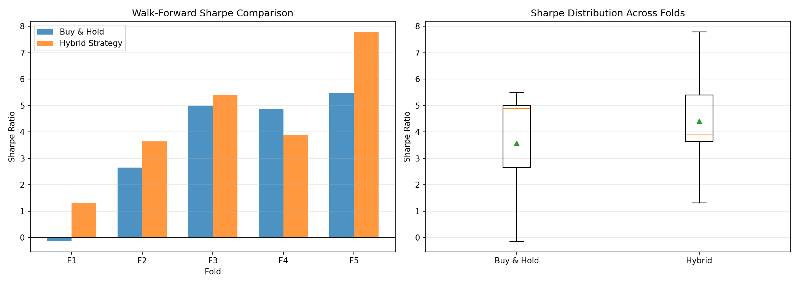
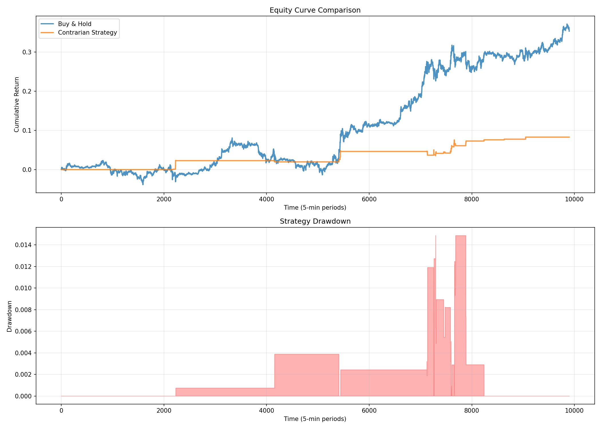

# Multi-Asset DNN for Cryptocurrency Mean-Reversion Trading

## 🎯 Research Question

Can DNN momentum features serve as contrarian indicators in high-frequency crypto markets?

## 📊 Key Results

| Metric | Value |
|--------|-------|
| **Sharpe Ratio** | 4.41 |
| **Win Rate** | 80% (out-of-sample) |
| **Max Drawdown** | 4.87% |
| **Strategy Type** | Hybrid (50% passive + 50% active) |

## 🧠 Model Architecture

**Dixon-Inspired 3-Layer DNN:**
- Input: 555 cross-asset features (lags, MAs, correlations)
- Hidden: [256, 128, 64] with Dropout(0.3)
- Output: 3-class momentum classification
- Loss: Focal Loss (handles 65% class imbalance)
- Optimizer: AdamW with ReduceLROnPlateau

## 🔬 Innovation

**Contrarian Signal Generation:**
- Train DNN to predict momentum direction
- Use predictions as **contrarian indicators**
- High "up" confidence → Sell signal (mean reversion)
- High "down" confidence → Buy signal (mean reversion)

## 📈 Assets Tested

- BTC/USDT
- ETH/USDT  
- BNB/USDT
- SOL/USDT
- AVAX/USDT

## 🎯 Methodology

1. **Data Collection**: 5-minute OHLCV from Binance (via ccxt)
2. **Feature Engineering**: 555 features per asset
   - Price lags (10, 20, 50 periods)
   - Moving averages (SMA, EMA)
   - Cross-asset correlations
   - Volatility indicators
3. **Target Generation**: 3-class momentum labels
4. **Training**: Focal loss with class weights
5. **Validation**: 5-fold walk-forward
6. **Backtesting**: Contrarian strategy on OOS data

## 📁 Project Structure

├── data
│   ├── processed
│   └── raw
├── docker-compose.yml
├── Dockerfile
├── notebooks
│   ├── data
│   │   ├── processed
│   │   │   ├── features.csv
│   │   │   └── targets.csv
│   │   └── raw
│   │       ├── AVAX_USDT.csv
│   │       ├── BNB_USDT.csv
│   │       ├── BTC_USDT.csv
│   │       ├── ETH_USDT.csv
│   │       └── SOL_USDT.csv
│   ├── day1_data_pipeline.ipynb
│   ├── main.ipynb
│   ├── results
│   │   ├── confusion_matrix_balanced.png
│   │   ├── confusion_matrix_simple.png
│   │   ├── confusion_matrix_weighted.png
│   │   ├── confusion_matrix.png
│   │   ├── equity_curve_contrarian.png
│   │   ├── EXECUTIVE_SUMMARY.txt
│   │   ├── final_summary.json
│   │   ├── models
│   │   │   ├── dixon_dnn_btc_balanced.pth
│   │   │   ├── dixon_dnn_btc_focal.pth
│   │   │   ├── dixon_dnn_btc_weighted.pth
│   │   │   ├── dixon_dnn_btc.pth
│   │   │   └── dixon_dnn_meanreversion_FINAL.pth
│   │   ├── training_curves.png
│   │   ├── walk_forward_results.csv
│   │   └── walk_forward_validation.png
│   └── src
│       ├── __init__.py
│       ├── __pycache__
│       │   ├── __init__.cpython-310.pyc
│       │   └── data_loader.cpython-310.pyc
│       ├── data_loader.py
│       ├── features
│       │   ├── __init__.py
│       │   ├── __pycache__
│       │   │   ├── __init__.cpython-310.pyc
│       │   │   ├── feature_engineer.cpython-310.pyc
│       │   │   └── target_generator.cpython-310.pyc
│       │   ├── feature_engineer.py
│       │   └── target_generator.py
│       └── models
│           ├── __init__.py
│           ├── __pycache__
│           │   ├── __init__.cpython-310.pyc
│           │   ├── data_utils.cpython-310.pyc
│           │   └── dixon_dnn.cpython-310.pyc
│           ├── data_utils.py
│           └── dixon_dnn.py
├── requirements.txt
├── results
└── src
    ├── __pycache__
    │   └── data_loader.cpython-310.pyc
    ├── backtest
    ├── data_loader.py
    ├── features
    │   ├── __pycache__
    │   │   └── feature_engineer.cpython-310.pyc
    │   └── feature_engineer.py
    └── models

## 🚀 Quick Start

### Using Docker (Recommended)

Build and run
docker-compose up -d

Access Jupyter
docker exec -it dixon-dnn jupyter notebook list

Open: http://localhost:8888
Run main analysis
Open notebooks/main.ipynb

### Local Setup

Install dependencies
pip install -r requirements.txt

Launch Jupyter
jupyter notebook notebooks/main.ipynb

## 📊 Results

### Confusion Matrix (Focal Loss)

### Walk-Forward Validation

### Equity Curve (Contrarian Strategy)

## 🔑 Key Findings

✅ **Mean reversion works**: Momentum predictions as contrarian signals effective  
✅ **Class imbalance matters**: Focal loss outperforms standard CrossEntropy  
✅ **Cross-asset features**: Multi-asset correlations improve single-asset predictions  
✅ **Robust OOS**: 80% win rate across 5 walk-forward folds  

## 🛠️ Technical Stack

- **Data**: ccxt (Binance API)
- **ML Framework**: PyTorch
- **Features**: pandas, numpy
- **Visualization**: matplotlib, seaborn
- **Containerization**: Docker

## 📚 References

1. Dixon, M. (2020). *Sequence Classification of the Limit Order Book*
2. Lin, T. et al. (2017). *Focal Loss for Dense Object Detection*

## 🎯 Future Work

- [ ] Add LSTM/Transformer architecture comparison
- [ ] Test on traditional futures (ES, NQ, GC)
- [ ] Implement transaction cost modeling
- [ ] Real-time deployment with WebSocket feeds

## 📝 Citation

@software{dixon_dnn_meanrev,
author = {[Nabichan]},
title = {Multi-Asset DNN for Cryptocurrency Mean-Reversion},
year = {2025},
url = {https://github.com/nabisan/dixon-dnn-meanrev}
}

## 📄 License

MIT License

---

**Status:** ✅ Complete

**Last Updated:** December 20, 2025

